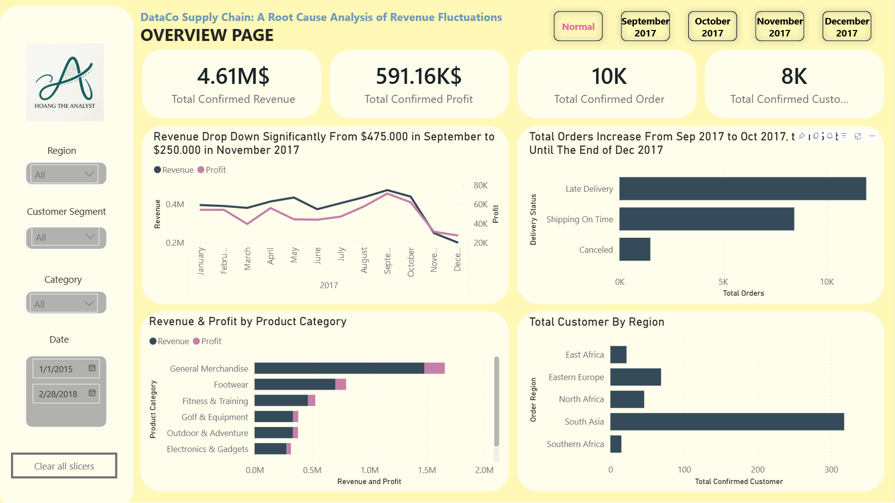

# DataCo Root Cause Analysis – Revenue Decline in Q4/2017

## Tech Stack
Power BI

## Overview
This project analyzes the root causes behind DataCo's sharp decline in revenue and profit during Q4/2017 through comprehensive Sales, Logistics, and Customer analysis.

---

## 📊 Dashboard Preview


### 🔗 Interactive Dashboard
[View on Power BI Service](https://app.powerbi.com/links/jNQfaellG9?ctid=7212a37c-41a9-4402-9f69-ac32c6f76e1a&pbi_source=linkShare&bookmarkGuid=b8fd82da-2d85-410b-82c9-e3dc0ea21838)

---

## 📋 Business Problem & Objectives

### Problem
DataCo experienced a sharp decline in Revenue and Profit during Q4/2017, while losing customers from key regions such as Europe.

### Objective
Identify the root causes behind the decline through Sales, Logistics, and Customer analysis.

---

## 🎯 Business Questions

- Why did Revenue and Profit decline sharply in Q4/2017?
- Which product categories and customer regions were most affected?
- Did logistics performance significantly impact on the downturn?
- Did order customer performance significantly impact on the downturn?

---

## 📊 Dataset & Assumptions

### Dataset Information
- **Source:** [Kaggle - DataCo Smart Supply Chain](https://www.kaggle.com/datasets/shashwatwork/dataco-smart-supply-chain-for-big-data-analysis)
- **Time Period:** January 2015 - February 2018
- **Data Type:** Order-level dataset including Customer, Product, Order Status, Shipping, Revenue, and Profit information

### Data Assumptions
- Only Complete and Closed orders are counted as successful revenue
- Orders with statuses such as Pending or On Hold are treated as unresolved

---

## 🔧 Key Steps Taken

- **Cleaning:** Cleaned and standardized customer, product, and country data using Power Query.
- **Modeling:** Built star schema model with fact_sales, dim_customer, dim_product & dim_order_location
- **Key Metrics:** Created Revenue, Profit, AOV, Delivery Success Rate, and Order Success Rate using DAX.
- **Report:** Developed dashboards for Executive Overview, Sales, Logistics, and Customer Analytics.

---

## 💡 Key Insights

- Revenue, Profit, and AOV declined heavily from October to December 2017 despite relatively increase order volume.
- Electronics & Gadgets became the dominant category in October 2017 but almost disappeared in November together with most other categories, leaving General Merchandise as the only major contributor.
- Logistics metrics such as Delivery Success Rate and Shipping Mode remained relatively stable, suggesting operational performance was not the main reason behind the decline.
- In September 2017, most orders came from Europe. After the category shift, demand from these regions dropped dramatically.

---

## 📈 Implications

- The decline is mainly driven by a product structure shift that led to a loss of European demand; if this is not addressed, the business risks continued customer migration from key regions and long-term erosion of core revenue streams.

---

## 🚀 Recommendations

- Refocus on stable high-performing categories instead of over-depending on Electronics & Gadgets.
- Rebuild customer acquisition campaigns in Europe.
- Monitor category contribution trends more closely to detect abnormal revenue concentration early.

---

## 📝 Project Structure

```
Project 4 - DataCo Root Cause Analysis – Revenue Decline in Q4/2017
├── README.md
├── Dashboard/
│   └── [Visualizations and findings]
├── Dataset/
│   └── DataCoSupplyChainDataset.csv
├── Images/
└── README in DOCX/
```

---

**Last Updated:** May 2026
